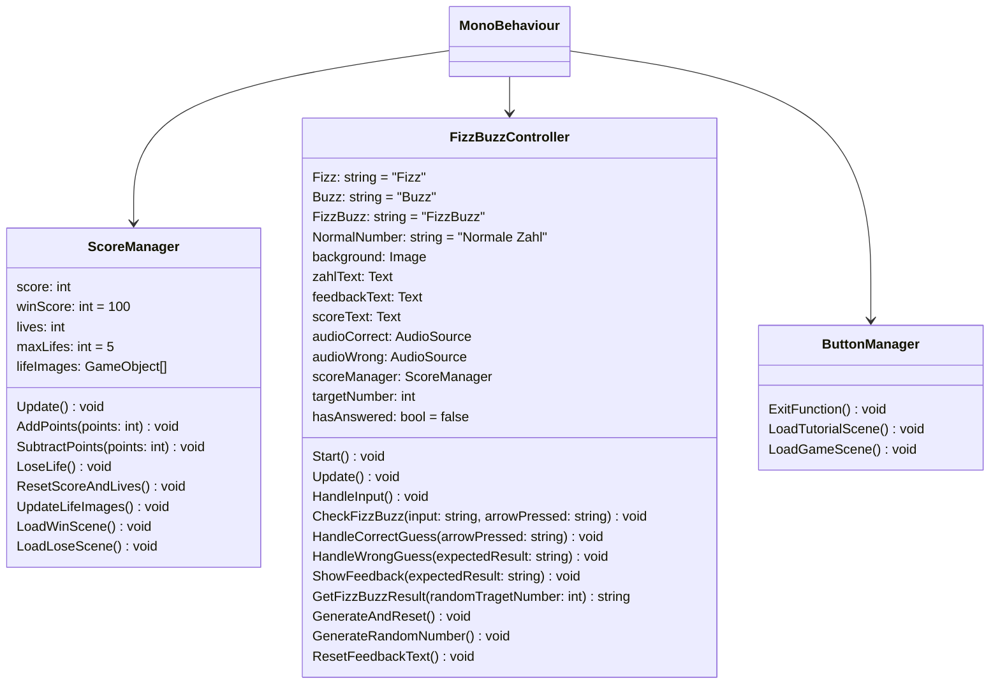

# 11-endabgabe-skleber
### Spielbeschreibung

FizzBuzz ist ein interaktives Lernspiel, bei dem man die Teilbarkeitsregeln von 3 und 5 lernt. 
Wenn eine Zahl durch 3 teilbar ist, wird "Fizz" ausgegeben, wenn sie durch 5 teilbar ist, wird "Buzz" ausgegeben, 
und wenn sie sowohl durch 3 als auch durch 5 teilbar ist, wird "FizzBuzz" ausgegeben. Andernfalls wird einfach die Zahl selbst ausgegeben. 

Dem Spieler wird eine zufällige Zahl auf dem Bildschirm präsentiert. Die Aufgabe des Spielers besteht darin, zu erkennen, ob diese Zahl durch 5 (Buzz), durch 3 (Fizz), durch 3 und 5 (FizzBuzz) oder durch keine der beiden Zahlen teilbar ist.

Der Spieler hat insgesamt 5 Leben, und das Ziel ist es, 100 Punkte zu erreichen! Bei jeder richtigen Antwort werden Punkte hinzugefügt, bei jeder falschen Antwort werden Punkte abgezogen.

### Spielanleitung

- Pfeiltaste nach oben = FizzBuzz
- Pfeiltaste nach unten = Normale Zahl
- Pfeiltaste nach rechts = Buzz
- Pfeiltaste nach links = Fizz
- Leertaste = Zahl überspringen/nächste Zahl

#### Makey Makey

1. Schließen Sie das Makey Makey-Board mit dem mitgelieferten USB-Kabel an Ihren Computer an. Der Computer erkennt das Makey Makey-Board als eine Tastatur oder Maus.
2. Verbinden Sie eine Alligator-Klemme mit einer der Erdungsbuchsen am unteren Rand des Makey Makey-Boards. Halten Sie das andere Ende der Klemme in Ihrer Hand, da Ihr Körper als Leiter dient.
3. Verbinden Sie andere Alligator-Klemmen mit den richtigen Anschlüssen auf der Schablone, bedeutet Pfleitaste rechts mit Pfeiltaste rechts usw..
4. Drücke Sie die gewünschte Eingabe auf der Schablone um zu spielen.

### Code Dokumentation

#### Welche Szene muss gestartet werden?
Starten Sie die Szene: StartScene

#### ULM - Klassendiagramm

### Feedback Testpersonen

Alle fanden das Spiel benutzerfreundlich, der einzige kleine Mangel waren die gleichen Farben von den Herzen, also dem Leben und der Hintergrund wenn man die Zahl falsch einschäzt.

Das Punktesystem und die Lebensanzeige hat sehr überzeugt.

Allerdings wird das Spiel nach 3-4 mal spielen langweilig und eintönig.

Fehler waren keine auffindbar.

